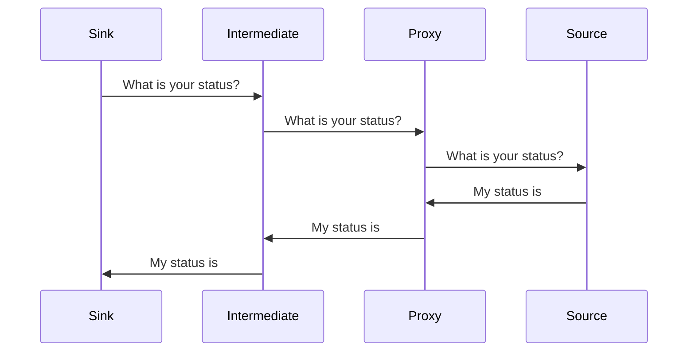

[LinkedIn Group](https://www.linkedin.com/groups/13701564/)

Data Flow in Sensor Network:

# group-materials
Materials for LinkedIn "MultiWare Engineering" group members

While LinkedIn does provide infrastructure for special interest groups,
they do not provide for access to group associated materials and docs.

That is what this repository is for. It is a public repository because 
the materials are not a secret, although some materials have licensing
or copyright nuances.

I noticed that discussions posted in the group, while being editable,
provide no method of updating included images.
